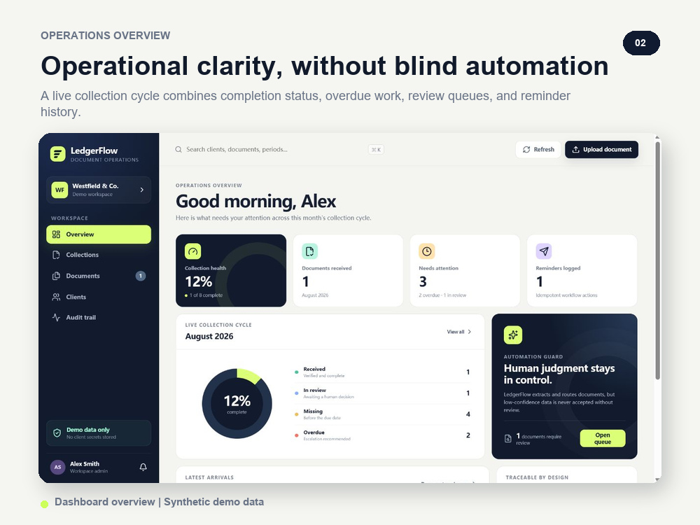

# LedgerFlow

**Human-controlled document collection and workflow automation.**

LedgerFlow is a portfolio-grade operations application for firms that collect recurring invoices,
statements, contracts, and compliance documents from clients. It turns uploads into a traceable
workflow: extract known fields, flag uncertainty, require a human decision, update collection state,
log reminders, and export a clean operational view.

The project deliberately avoids a common document-AI failure mode: an uploaded file is never marked
complete merely because a parser produced plausible text.



## Project tour

- [Visual case study (PDF)](portfolio/output/pdf/ledgerflow-case-study.pdf)
- [Architecture and production evolution](docs/ARCHITECTURE.md)
- [Guided demo script](portfolio/DEMO_VIDEO_SCRIPT.md)

## Product capabilities

- Client and recurring document requirement management
- PDF, DOCX, TXT, CSV, JSON, and image intake with a 10 MB limit
- SHA-256 duplicate detection per client
- Deterministic document classification and structured field extraction
- Confidence scoring with an explicit human review queue
- Collection state machine: received, in review, missing, or overdue
- Idempotent-style reminder history (email delivery is simulated in the MVP)
- Audit timeline for every workflow mutation
- CSV export for downstream operations
- Responsive Vue 3 management dashboard
- Docker Compose deployment and a documented REST API
- Automated API tests for the critical workflow

## Architecture

```text
Vue 3 + TypeScript
        |
        v
FastAPI REST API ---- Audit log
        |
        +---- SQLAlchemy ---- SQLite (local) / PostgreSQL-ready
        |
        +---- Document parser ---- PDF / DOCX / structured text
        |
        +---- Local storage (MVP) / S3-ready boundary
```

See [docs/ARCHITECTURE.md](docs/ARCHITECTURE.md) for the data flow, state machine, trust boundaries,
and production evolution path.

## Quick start with Docker

```bash
docker compose up --build
```

Open:

- Dashboard: `http://localhost:8080`
- API documentation through the API container: `http://localhost:8000/docs` when port 8000 is
  exposed for development

Docker stores the SQLite database and uploaded files in the `ledgerflow_data` named volume.

## Local development

### API

```powershell
python -m venv .venv
.\.venv\Scripts\python.exe -m pip install -r backend\requirements-dev.txt
Set-Location backend
..\.venv\Scripts\python.exe -m uvicorn app.main:app --reload
```

The API runs at `http://127.0.0.1:8000`; interactive documentation is available at `/docs`.

### Web application

```powershell
Set-Location frontend
npm install
npm run dev
```

The Vite development server runs at `http://127.0.0.1:5173` and proxies `/api` to FastAPI.

## Demo workflow

1. Open **Collections** and create a requirement or choose one of the seeded records.
2. Upload `backend/sample_documents/invoice_example.txt` for the matching client.
3. Open **Documents** and inspect the extracted fields and confidence score.
4. Approve the document. The linked requirement becomes **Received**.
5. Send a reminder for another missing requirement and inspect **Audit trail**.
6. Export the collection register as CSV.

All seeded companies, people, email addresses, documents, and amounts are synthetic.

## API surface

| Method | Path | Purpose |
|---|---|---|
| GET | `/api/dashboard` | Aggregated collection health |
| GET/POST | `/api/clients` | List or create clients |
| GET/POST | `/api/requirements` | List or create expected documents |
| GET | `/api/documents` | List parsed documents |
| POST | `/api/documents/upload` | Upload, hash, extract, classify, and route a document |
| POST | `/api/documents/{id}/review` | Approve or reject extracted data |
| POST | `/api/requirements/{id}/remind` | Log a targeted reminder |
| GET | `/api/audit` | Read the workflow audit timeline |
| GET | `/api/export/requirements.csv` | Export the current collection register |

## Verification

```powershell
Set-Location backend
..\.venv\Scripts\python.exe -m ruff check app tests
..\.venv\Scripts\python.exe -m pytest

Set-Location ..\frontend
npm run typecheck
npm run build
```

## MVP boundaries

- Image files are accepted but routed to human review because a system OCR binary is not bundled.
- Reminder delivery is represented by a durable workflow record; no external email is sent.
- SQLite and local file storage optimize the public demo for one-command startup.
- Authentication and role-based access are documented production steps, not simulated security.

These boundaries are explicit so the demo never claims production guarantees it does not provide.

## License

[MIT](LICENSE)
