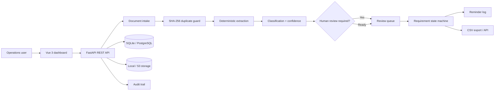

# LedgerFlow architecture

LedgerFlow is intentionally delivered as a modular monolith. The MVP keeps deployment simple while
separating transport, persistence, workflow, and document analysis concerns so that background
workers and external storage can be introduced without rewriting the product.



## Domain state

Requirement status is derived from document state and the due date:

```text
approved document                 -> received
ready / needs_review document     -> in_review
no approved document + past due   -> late
no approved document + before due -> missing
```

This prevents a client upload from being treated as complete until a human has verified it.

## Trust boundaries

- Uploaded filenames are normalized to their basename and stored under random UUID names.
- Every upload is size-limited and checked against an explicit extension allowlist.
- SHA-256 hashes prevent duplicate ingestion for the same client.
- Deterministic extraction never invents values. Unknown data remains unknown.
- Every mutating workflow action creates an audit entry.
- The local demo contains synthetic data only.

## Production evolution

The interfaces are designed to allow these replacements:

| MVP component | Production replacement |
|---|---|
| SQLite | PostgreSQL |
| Local upload directory | S3-compatible object storage |
| Inline extraction | Celery/RQ worker with Redis |
| Simulated reminder | Transactional email provider |
| Manual image handling | OCR adapter with confidence calibration |
| Demo workspace | OAuth/OIDC and role-based access control |
